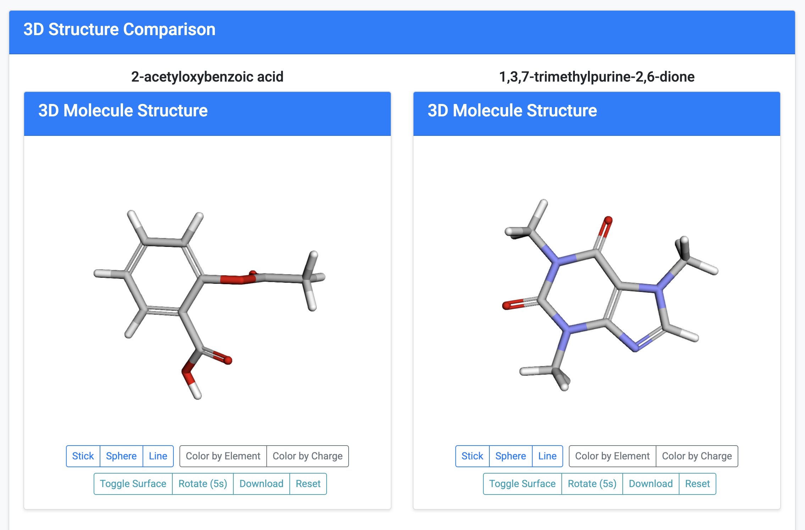

# BioVis Explorer Documentation

## Overview

BioVis Explorer is a web application for searching, analyzing, and visualizing chemical compounds and their biological properties. The application integrates with PubChem, a comprehensive database of chemical substances and their activities in biological assays, to provide researchers and students with an intuitive interface for exploring chemical and biological data.

## Search Component

The Search Component allows you to find chemical compounds by name or molecular formula. As you type, the autocomplete feature suggests matching compounds. Results display with 2D structure images, compound names, and basic molecular information. Click "View Details" to see comprehensive information about any compound.

## Advanced Search Component

The Advanced Search Component enables detailed filtering of compounds based on their physicochemical properties. You can specify ranges for molecular weight, hydrophobicity (XLogP), and set maximum values for H-bond donors, H-bond acceptors, and rotatable bonds. For more targeted searches, enter SMILES notation for substructure matching or perform similarity searches based on a reference compound.

## Compound Details Component

The Compound Details Component provides comprehensive information about a selected compound. The page includes 2D structural representation, basic properties (molecular formula, weight, name), advanced properties (exact mass, monoisotopic mass, complexity), and a 3D interactive molecular viewer. External links to PubChem and PubMed resources are also provided for additional research.

## Molecule Viewer Component

The Molecule Viewer Component presents an interactive 3D visualization of molecular structures. Users can change display styles (stick, sphere, line), color schemes (by element or charge), toggle surface views, rotate structures, and reset the view. This component helps you examine the 3D structure and properties of chemical compounds.

## Bioactivity Summary Component

The Bioactivity Summary Component displays biological activity data for compounds. The summary includes total assay counts, activity status percentages, assay types, and target family distribution. Users can toggle detailed bioactivity data and link directly to PubChem for additional information. This component helps researchers understand how compounds interact with biological systems.

## Visualization Dashboard Component

The Visualization Dashboard Component enables side-by-side comparison of multiple compounds. Enter compound IDs to compare their structures, properties, and characteristics. The dashboard features 3D structure comparisons, multi-property radar charts for visualizing relative differences across key properties, bar charts for comparing specific properties, and detailed tabular data comparisons.

## Pathway Analysis Component

The Pathway Analysis Component illustrates how compounds interact in metabolic pathways and biological systems. Select a compound to view interactive pathway diagrams showing molecular interactions and relationships. The component displays pathway interaction summaries, including pathway names, interaction types, confidence levels, and scientific references.

## Docking Simulation Component

The Docking Simulation Component demonstrates how drug compounds bind to protein targets. Users can select different ligands and protein targets to visualize binding interactions. The interactive 3D viewer shows the molecular docking, while the binding analysis panel displays affinity scores, key interactions, and active site residues. Controls allow users to customize the display mode, color scheme, and animation settings.

## Getting Started

1. Start at the Search page by entering a compound name (e.g., "aspirin") or molecular formula (e.g., "C9H8O4")
2. Browse the search results and click "View Details" on any compound of interest
3. Explore the detailed compound information, 3D structure, and bioactivity data
4. Use the Advanced Search for more targeted compound discovery
5. Try the Visualization Dashboard to compare multiple compounds
6. Explore the Pathway Analysis and Docking Simulation components to understand biological interactions

## Tips for Effective Use

- For structure searches, use the SMILES notation format (e.g., "c1ccccc1" for benzene)
- When comparing compounds, use the PubChem CID numbers for precise identification
- The 3D molecule viewer performance may vary based on your device capabilities
- For pathway analysis and docking simulations, start with well-known compounds to understand the visualization features

## Data Sources

BioVis Explorer integrates data from PubChem, a comprehensive and publicly accessible database of chemical substances maintained by the [National Center for Biotechnology Information (NCBI)](https://www.ncbi.nlm.nih.gov/). All compound information, structures, and bioactivity data are retrieved through the PubChem REST API.
